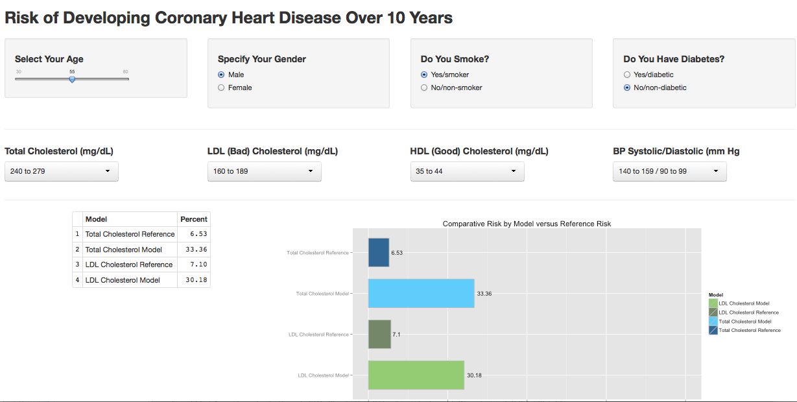

### Introduction

This app, named "CoronaryHeartDisease", is a tool to predict the 10-year probability of developing coronary heart disease.  This based on age, gender, smoking status, diabetes status, blood pressure, and cholesterol levels.

The models are taken from the following reference.  This describes a 12-year prospective study of 2489 men and 2856 women 30 to 74 years old at baseline with 12 years of follow-up.  Since the study group was 30 to 74 with 12 years follow up, the age range on this app was limited to 30 to 80.

>**Prediction of Coronary Heart Disease Using Risk Factor Categories**. Peter W. F. Wilson, MD; Ralph B. D’Agostino, PhD; Daniel Levy, MD; Albert M. Belanger, BS; Halit Silbershatz, PhD; William B. Kannel, MD. _**Circulation. 1998; 97**_: 1837-1847 doi: 10.1161/01.CIR.97.18.1837 


### Inputs

Assuming you have cholesterol and blood pressure data available, most of the inputs are obvious; however, there are two that benefit from explanantion.  From the criteria used in the original study:

* **Smoking Status**: You would select "Yes" if you have smoked regularly over the past 12 months.

* **Diabetes Status**: You would answer "Yes" if you are (a) being treated for diabetes with insulin or oral hypoglycemic agents, (b) have had 2 or more blood glucose determinations of 150 mg/dL, or a fasting glucose measurement over 140 mg/dL.


### Results and Outputs

There are 2 different predictive models used in the calculation, and these are presented along with the reference category values.

####1) Total Cholesterol Model and Reference Model

This model includes all variables **except** LDL Cholesterol level. The reference values are as follows.

```{r TCr, echo=FALSE}
refTable <- data.frame(
	c("Total Cholesterol", "HDL Cholesterol", "Blood Pressure",
		 "Smoking Status", "Diabetes Status"),
	c("160 to 199", "45 to 49", "120/80 to 129/84", 
		"Non-smoker", "No Diabetes"),
	c("160 to 199", "50 to 59", "120/80 to 129/84", 
		"Non-smoker", "No Diabetes"))

colnames(refTable) <- c("Risk Factor", "Male", "Female")
	
refTable
```


####2) LDL Cholesterol Model and Reference Model

This model includes all variables **except** Total Cholesterol level.

The models also have baseline or reference comparisons.  In the reference cases, **age and gender affect the reference value, but the other factors do not.**

Also, it is possible to have more favorable blood pressure or cholesterol values than the reference, in which case the calculated risk is lower than the baseline risk.

```{r LDLr, echo=FALSE}
refTable <- data.frame(
	c("LDL Cholesterol", "HDL Cholesterol", "Blood Pressure",
		 "Smoking Status", "Diabetes Status"),
	c("100 to 129", "45 to 49", "120/80 to 129/84", 
		"Non-smoker", "No Diabetes"),
	c("100 to 129", "50 to 59", "120/80 to 129/84", 
		"Non-smoker", "No Diabetes"))

colnames(refTable) <- c("Risk Factor", "Male", "Female")
	
refTable
```


The App dynamically displays the calculation results in tabular and graphical form.

